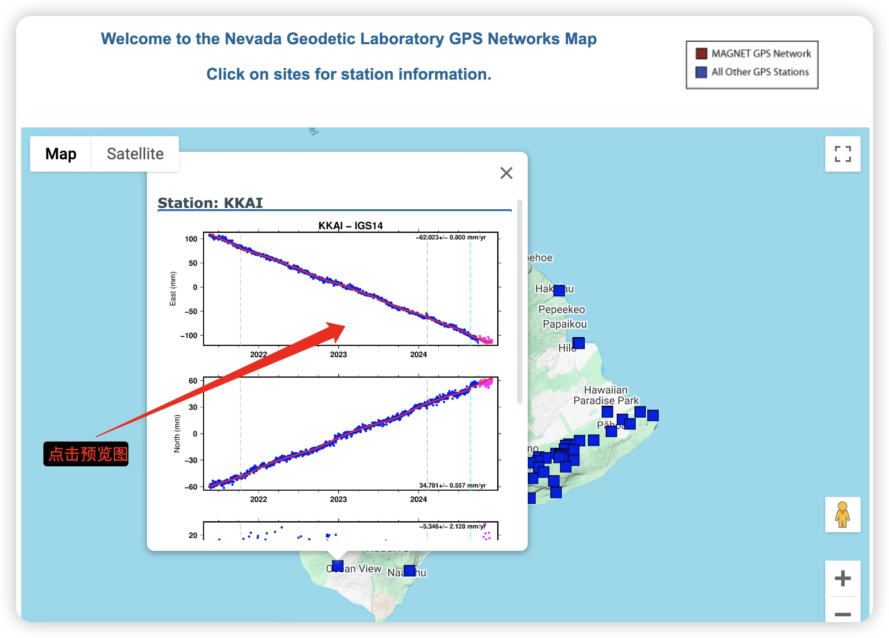

# GNSS时序形变位移数据下载
- [引言](#引言)
- [下载方式](#下载方式)
- [注意事项](#注意事项)

## 引言
**目的**：教大家如何下载***GNSS时序形变位移数据***，本人主要是利用GNSS位移结果进行InSAR相关成果的精度验证工作。若大家需要在自己的研究领域需要用到GNSS位移数据可以参考本文方式获取。

**数据概况**：GNSS形变位移数据（***不包括~~GNSS原始数据~~***，属于GNSS结果产品的下载）

**目标人员**：科研工作者、生产应用等

## 下载方式
**下载地址**：[内华达大地测量实验室](http://geodesy.unr.edu/)

**step1**：打开网址后，我们看到左侧目录页中的***MAGNET GPS Network***栏目，点击下方的Network Information and Data。我们即可进入GNSS站点数据界面。

**step2**：我们进入Network Information and Data界面后，可以发现右侧出现了一个地图，我们***点击该地图***就能进入Google map交互界面。

**step3**：进入交互界面后通过鼠标滚轮放缩地图，左键按住拖动可以调整视图区域，找到目标研究区。点击其中一个GNSS站点图标可以预览其位移情况，***点击预览图***即可进入数据获取界面。

**step4**：在数据获取界面中，我们可以查看站点相关信息。根据自己目的下载所需数据即可。我使用的是24小时解的数据，***格式选择tenv3***。

## 注意事项
### 有关IGS14与PA之间的区别
**IGS14**：属于全球框架，具有坐标一致性的特点，不过其位移包含了板块运动趋势。

**PA**：属于局部板块基准，若进行局部形变对比，其更具有参考性，因为其已经去除了~~板块运动趋势~~。

(注意：PA是太平洋板块简称，其他板块基准也具有同样作用)

