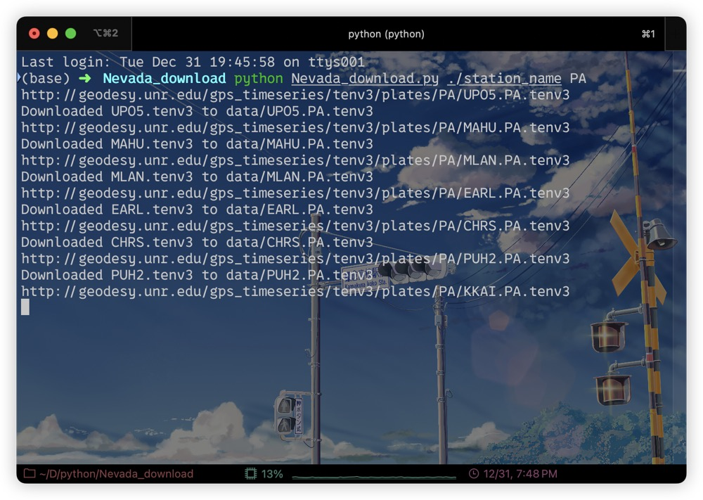

# 内华达大地测量实验室GNSS数据半自动化下载

## 前言
- **目的**：继上篇[GNSS时序形变位移数据下载](https://www.cnblogs.com/heqifeng/p/-/hqf-gnss-data-download)，介绍了内华达网站GNSS位移数据如何***手动交互***进行下载。后面发现若自己需要下载很多站点的数据，我要<u>**通过手动一个个去点击下载不太方便**</U>。为此自己设计了一个**根据<u>站点名字</u>文本文件**进行批量下载tenv3格式数据的python脚本供大家使用。

## 环境准备
所需工具与库：
- **Python3**：编程语言
- **requests**：网络请求库
- **argparse**：命令行参数解析库

安装命令：
```bash
pip install requests argparse
```

## 脚本使用说明
- **脚本功能**：根据站点名字文本文件批量下载tenv3格式数据
- **脚本使用说明查询**：
```bash
python Nevada_download.py -h
```

- **脚本参数**：
  - **file_path**：站点名字文本文件路径
  - **ref_base**：参考基准（例如PA）

- **脚本使用示例**：
```bash
python Nevada_download.py ./station_name PA
```


最后文件都会下载到当前目录下的`data`文件夹中。

打开其中的一个文件，可以看到数据格式如下：


## 脚本下载网址链接
目前脚本已经上传到github，大家可以自行下载使用：
- [https://github.com/eominehqf/Nevada_gnss_download](https://github.com/eominehqf/Nevada_gnss_download)

## 结语
- **脚本功能**：通过站点名字文本文件批量下载内华达大地测量实验室GNSS数据
- **脚本优势**：省时省力，适合需要下载大量站点数据的用户
- **脚本不足**：暂时只支持下载tenv3格式数据，后续根据需求可以进行扩展。因为目前是根据站点名批量下载数据，<u>**站点名的自动获取还没有好的方案**</u>，因此是半自动化。
