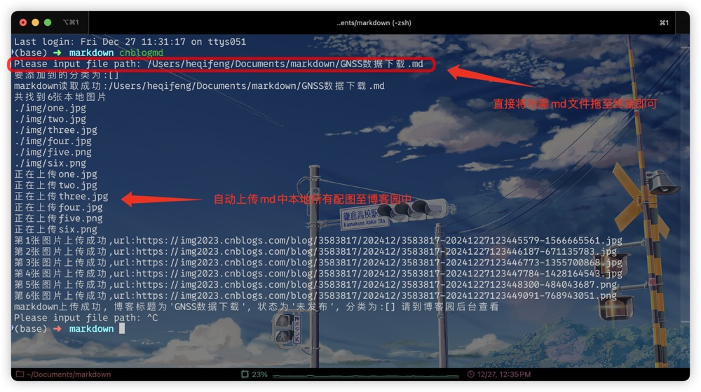

# 博客园markdown与配图自动上传配置（mac版 m芯片）
- [引言](#引言)
- [安装配置工具](#安装配置工具)
- [尾注](#尾注)

## 前言
**目的**：因为自己使用markdown写博客，但是在博客园上面发布的时候，<mark>***发现本地写好的markdown文件，上传到博客园上面，图片需要一张一张重新上传***</mark>，后面了解到有dotnet-cnblog工具，但是该工具是基于 .NET Runtime 5.0开发的，该工具不适配m芯片mac。后面有测试了**pycnblog工具**，问题解决的同时个人感觉配置也更为简单，因此记录一下自己工具搭建步骤，可供需要的人参考。

## 安装配置工具
**第一步**: 从github上克隆工具`git clone git@github.com:dongfanger/pycnblog.github`，同时需要是用自己环境的python安装所需库`pip install pyyaml`。

**第二步**：在克隆文件目录下的`config.yaml`文件中配置博客园账号密码，以及博客园的地址。

```javascript
# blog_url在博客后台>设置，页面最下方的MetaWeblog访问地址。 https://rpc.cnblogs.com/metaweblog/testblog
blog_url: https://rpc.cnblogs.com/metaweblog/testblog
# blog_id就是访问地址的尾巴， testblog。
blog_id: "testblog"
# username是Metaweblog用户名。
username: "zhangsan"
# password是metaweblog访问令牌。
password: "123456"
```


**第三步**：在***环境变量配置文件中添加克隆项目的路径***，这样就可以在任何地方使用该工具。我使用的是zsh，因此在`.zshrc`文件中添加如下代码。更换项目路径在终端输入如下代码，即可生效。
```shell
cat <<EOF >> ~/.zshrc
# /Users/username/pycnblog为克隆项目的路径
export PATH="$PATH:/Users/username/pycnblog"
EOF

source ~/.zshrc
```

**第四步**：***修改cnblogmd文件***，我根据zsh格式进行修改。
```shell
#!/usr/bin/env zsh
while true; do
    read "filePath?Please input file path: "  # 用 zsh 格式读取路径
    # 用python脚本上传markdown文件, /Users/heqifeng/Documents/git_clone/pycnblog/upload.py为上传脚本路径
    python /Users/heqifeng/Documents/git_clone/pycnblog/upload.py "$filePath"
done
```

**第五步**：在终端输入`cnblogmd`，即可使用该工具上传markdown文件及对应配图到博客园。完成上传后，使用`command`+`c`退出脚本。最后去自己的博客园后台查看上传效果，确认无误后即可发布。


## 尾注
- 本文主要是针对mac m芯片，zsh环境进行配置，其他环境配置方式可能有所不同。
- 感谢pycnblog工具的开发者，使得我们可以更方便的上传markdown文件到博客园。工具地址：[pycnblog](https://github.com/dongfanger/pycnblog)。
- 本文还参考了[【Typora + 博客园 】如何高效的在博客园上编写MD格式的博客](https://cloud.tencent.com/developer/article/1957905)，感谢作者的分享。

